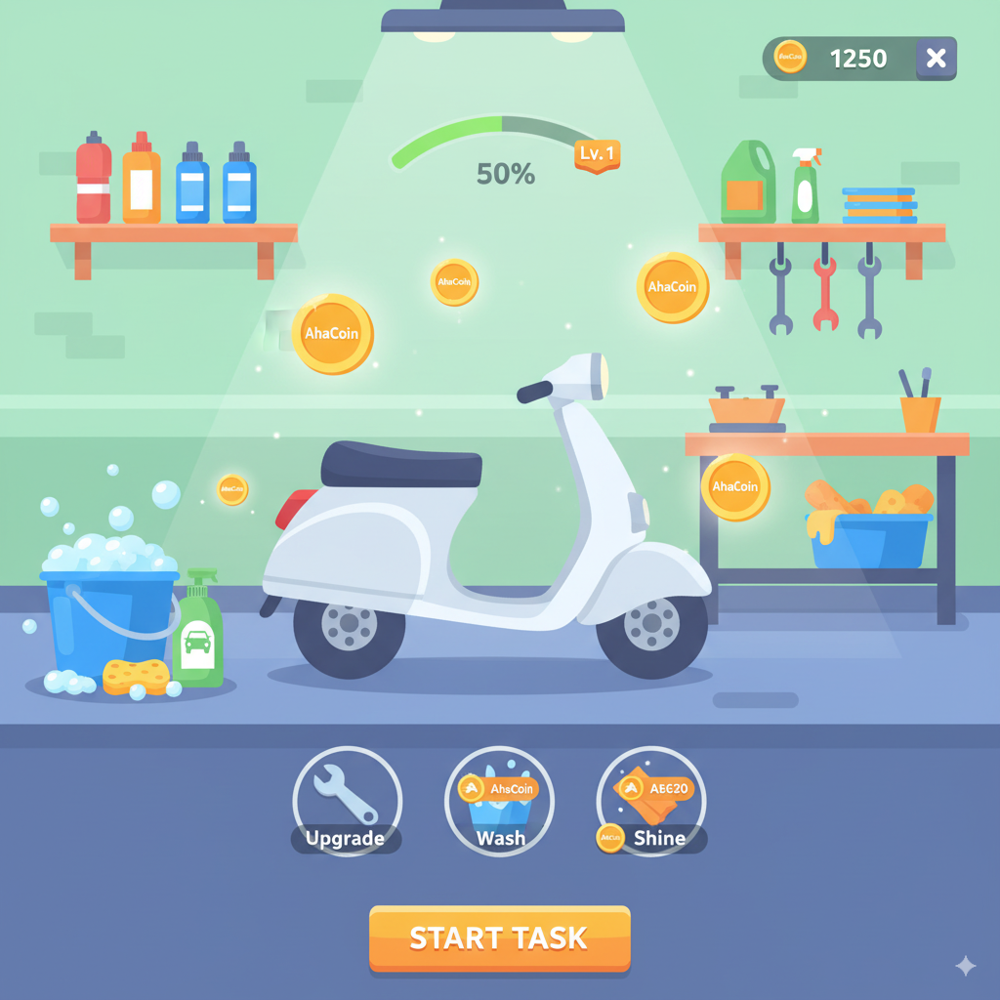

# Aha Vehicle Care — Scooter Sprint Mini Game

A lightweight Next.js 15 + React 19 web app featuring an HTML5 Canvas racing mini‑game at `/racing`. Designed mobile‑first, but fully playable on desktop.



---

## Quick start (run locally)

Prerequisites:
- Node.js 18.18+ or 20+ (recommended)
- npm 10+

1) Install dependencies
```bash
npm install
```

2) Start the dev server (Turbopack)
```bash
npm run dev
```

3) Open the app
- Home: http://localhost:3000/
- Game: http://localhost:3000/racing

Optional: run on another port (e.g., 4000)
```bash
npm run dev -- -p 4000
```

No environment variables are required to run locally.

---

## Production build
```bash
# create an optimized build
npm run build

# start the production server
npm start
```
Then open http://localhost:3000 (or your chosen port).

---

## Available scripts
- `npm run dev` — start Next.js dev server with Turbopack
- `npm run build` — production build (includes TypeScript checks)
- `npm start` — start the production server
- `npm run lint` — run ESLint

---

## Game overview
- Theme: Casual scooter race on a sunny city loop.
- Rendering: HTML5 Canvas for gameplay with React UI overlay (HUD, minimap, buttons).
- Input:
  - Mobile: drag left/right on the canvas to steer; tap the Boost button to boost.
  - Desktop: A/D or Left/Right to steer; Space to Boost; P/Esc to pause.
- Objective: Complete 3 laps and finish first.
- Collectibles: Coins on the track add to your global coins.
- Power‑up: Short speed boost with cooldown and visual trail.
- AI: Two opponents with lane‑following, mild rubber‑banding, and occasional boosts.

### Controls (quick)
- A/D or ←/→: steer
- Space or Boost button: boost
- P or Esc: pause

---

## Key files
- Route: `src/app/racing/page.tsx`
- Canvas renderer: `src/components/game/GameCanvas.tsx`
- HUD: `src/components/game/HUD.tsx`
- Minimap: `src/components/game/MiniMap.tsx`
- Boost button: `src/components/game/BoostButton.tsx`
- Victory overlay: `src/components/game/VictoryOverlay.tsx`
- Game core loop/state: `src/game/core/engine.ts`
- World/track helpers: `src/game/core/world.ts`
- Opponent AI: `src/game/core/ai.ts`

---

## Troubleshooting
- Port already in use: change port with `npm run dev -- -p 4000`.
- Node version issues: ensure Node 18.18+ or 20+ (`node -v`).
- Clean state: delete `.next/` if you run into stale build artifacts and restart the dev server.
- Fresh install: remove `node_modules` and `package-lock.json`, then `npm install`.

---

## Assets
- Simple vector drawing on Canvas for scooters/track.
- UI icons and sample images live under `public/`. Replace with your own as needed.
